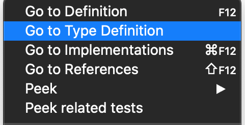

# Include TypeScript in the mdBook page

To use TypeScript in the mdBook, it is a good idea to put TS snippets in to separate `.ts` files and [include](https://rust-lang.github.io/mdBook/format/mdbook.html#including-files) them in the page. The advantage of this is that we get IDE [TypeScript language support](https://code.visualstudio.com/docs/languages/typescript), which is critical for learning and debugging TypeScript. 





## Version

```typescript
{{#include include_ts/ts/ts_version.ts}}
```
<pre id="version_output"></pre>

## number test

```typescript
{{#include include_ts/ts/number_test.ts}}
```
<pre id="number_output"></pre>

### greeter test
```typescript
{{#include include_ts/ts/greeter.ts}}
```
<pre id="greeter_output"></pre>

<script src="https://unpkg.com/typescript@latest/lib/typescriptServices.js"></script>
<script>
  let ts_code = '';
  const ts_code_sections = document.getElementsByClassName('language-typescript');
  for(let i = 0; i < ts_code_sections.length; i++) {
      ts_code += ts_code_sections[i].innerText;
  }
  console.log({ts});
  const js_code = ts.transpile(ts_code);
  console.log('ts_code');
  console.log(ts_code);
  console.log('js_code');
  console.log(js_code);
  eval(`(async () => { ${js_code }})()`);
</script>


