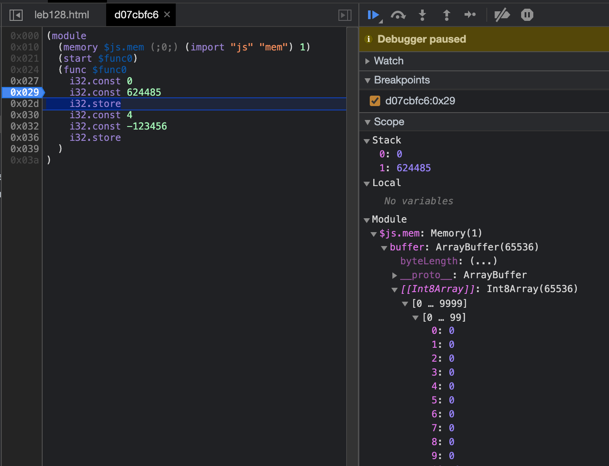
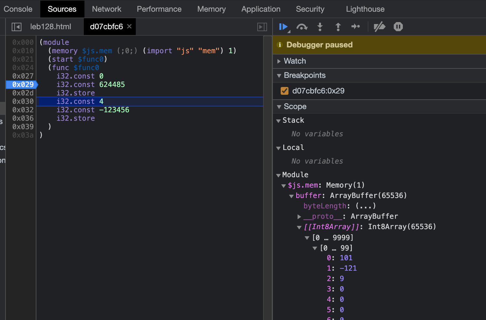
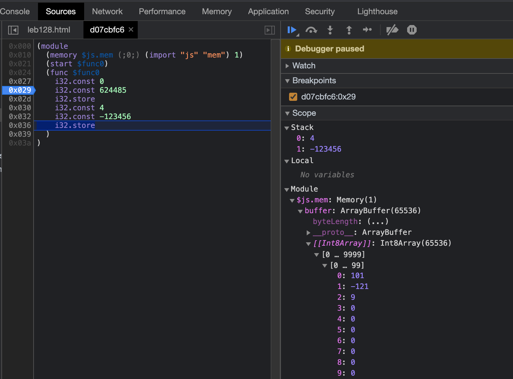
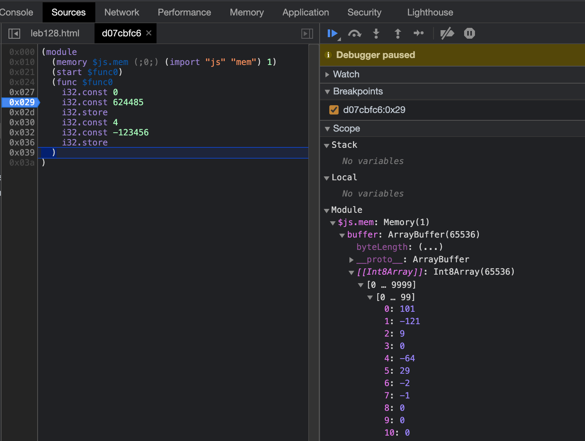

## LEB128
[source code](https://github.com/ontouchstart/cloudflare-page/blob/master/src/leb128.md)

[LEB128 or Little Endian Base 128](https://en.wikipedia.org/wiki/LEB128) is a form of variable-length code compression used to store an arbitrarily large integer in a small number of bytes.

We can use following helper function to write WASM bytecode where we need `i32.const`. 

```javascript
const leb128 = (i32) => {
    let bits = [];
    if(i32 < 0) {
        bits = (-i32).toString(2).split('');
        const pad = 7 - bits.length % 7;
        bits = [new Array(pad).fill(0), bits].flat();
        bits = bits.map((d) => ( d > 0 ? 0 : 1));
        bits =  (parseInt(bits.join(''), 2) + 1).toString(2).split('');
    }
    else {
        bits = (i32).toString(2).split('');
        const pad = 7 - bits.length % 7;
        bits = [new Array(pad).fill(0), bits].flat();
    }

    let output = []; 
    const n = bits.length / 7;
    for(let i = n - 1; i > 0; i--) {
        let byte = [1];
        for(let j = 0; j < 7; j++) {
            byte.push(bits[i * 7 + j]);
        } 
        output.push(parseInt(byte.join(''), 2).toString(16));
    }
    let byte = [];
    for(let j = 0; j < 7; j++) {
        byte.push(bits[j]);
    } 
    output.push(parseInt(byte.join(''), 2).toString(16));
    return output;
}
```

### Test
See [wikipedia](https://en.wikipedia.org/wiki/LEB128).

<pre id="test_result"></pre>

```javascript
document.getElementById('test_result').innerHTML = `
leb128(624485) = ${leb128(624485)}

leb128(-123456) = ${leb128(-123456)}
`
```

### Test in WASM

<pre id="wasm_result"></pre>









```javascript
const code = [
    0x00, // no local
    0x41, 0x00, // address: i32const 0x00, // address: i32.const 0xff
    0x41, leb128(624485).map((d) => (parseInt(d, 16))), // value: i32.const 624485
    0x36, 0x02, 0x00, // i32.store 
    0x41, 0x04, // address: i32const 0x01, // address: i32.const 0xff
    0x41, leb128(-123456).map((d) => (parseInt(d, 16))), // value: i32.const -123456
    0x36, 0x02, 0x00, // i32.store 
  ].flat();

const section = (i, data) => {
    if(i === 0x01) { // type
        return [i, 0x04, 0x01, 0x60, 0x00, 0x00]; 
    }
    if(i === 0x02) { // import
        if(data[i].length === 5) {
            const mod = data[i][0].split('');
            const name = data[i][1].split('');
            const type = data[i][2];
            const min = data[i][3];
            const max = data[i][4];
            const total = mod.length + name.length + 6;
            return [
              i, 
              total, 
              0x01, 
              mod.length, mod.map(d => (d.charCodeAt(0))),
              name.length, name.map(d => (d.charCodeAt(0))),
              type, 
              min, 
              max].flat();
        }
        else {
            return [];
        }
    }
    if(i === 0x03) { // func
        return [i, 0x02, 0x01, 0x00];
    }
    if(i === 0x07) { // export
        return [];
    }
    if(i === 0x08) { // start
        return [i, 0x01, 0x00]
    }
    if(i === 0x0a) { // code
        if(data[i].length > 1 ) {
            const total = data[i].length + 3;
            return [i, total, 0x01, data[i].length + 1, data[i], 0x0b].flat();
           
        }
        else {
          return [i, 0x04, 0x01, 0x02, 0x00, 0x0b];
        }
    }
    return [];
}

const wasm = async ({ code }) => {
    const data = [
    [], // 0 custom section
    [], // 1 type section
    ["js", "mem", 0x02, 0x00, 0x01], // 2 import section memory type
    [], // 3 function section 
    [], // 4 table section
    [], // 5 memory section
    [], // 6 global section
    [], // 7 export section
    [], // 8 start section
    [], // 9 element section
    code, // 10 code section store 0x01 at the first byte
    [], // 11 data section
    [], // 12 data count section
];
    const magic = [0x00, 0x61, 0x73, 0x6d];
    const version = [0x01, 0x00, 0x00, 0x00];
    let bytes = magic.concat(version);
    for(let i = 0; i < data.length; i++) {
        console.log('section', i, section(i, data));
        bytes = bytes.concat(section(i, data));
    }
    return await WebAssembly.compile((new Uint8Array(bytes)).buffer);
}

const module = await wasm({ code });
const mem = new WebAssembly.Memory({ initial: 1, maximum: 1 });
const heap = new Uint8Array(mem.buffer);
const env = { js: { mem }};
const instance = await WebAssembly.instantiate(module, env);

let x = 0;
let y = 0;
let offset = 0;

const hexdump = ({ hex, data } ) => {
    let output = '';
    for (let i = offset; i < offset + 0x100; i += 4) {
        if (i < data.length - 4) {
            // the byte order is different from canvas version 
            // because we do not group 4 byte as a representation of an i32 
            for (let j = 0; j < 4; j++) {  
                if (data[i + j] < 0x10) {
                    output += `0${data[i + j].toString(16)}`;
                } else {
                    output += `${data[i + j].toString(16)}`;
                }
            }
            if (((i - offset) % 0x20) === 0x1c) {
                output += '\n';
            }
            else {
                output += ' ';
            }
        }
    }
    hex.innerHTML = `
x: 0x${parseInt(x).toString(16)}
y: 0x${parseInt(y).toString(16)}
offset: 0x${offset.toString(16)} 
(mouse point = upper left corner of hexdump)        

(8 x 8) i32 = 256 bytes (1/256 of the total memory of a 64K page)
(0x${0x10000.toString(16)} = 0x${0x100.toString(16)} * 0x${0x100.toString(16)} = ${0x100 * 0x100} )

${output}
`;
};


const hex = document.getElementById('wasm_result');
hexdump({hex, data: heap});
```

<script>
  let code = '(async () => {';
  const code_sections = document.getElementsByClassName('language-javascript');
  
  for(let i = 0; i < code_sections.length; i++) {
      code += code_sections[i].innerText;
  }
  code += '})()';
  eval(code);
</script>